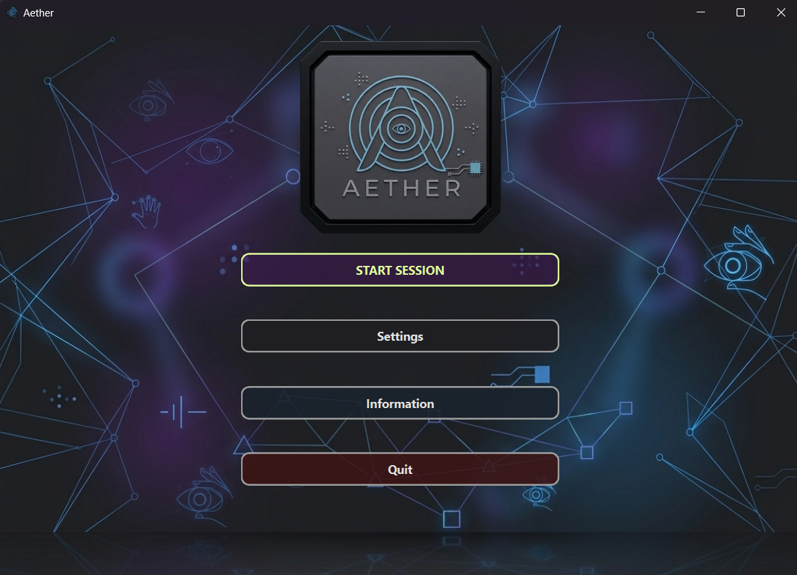
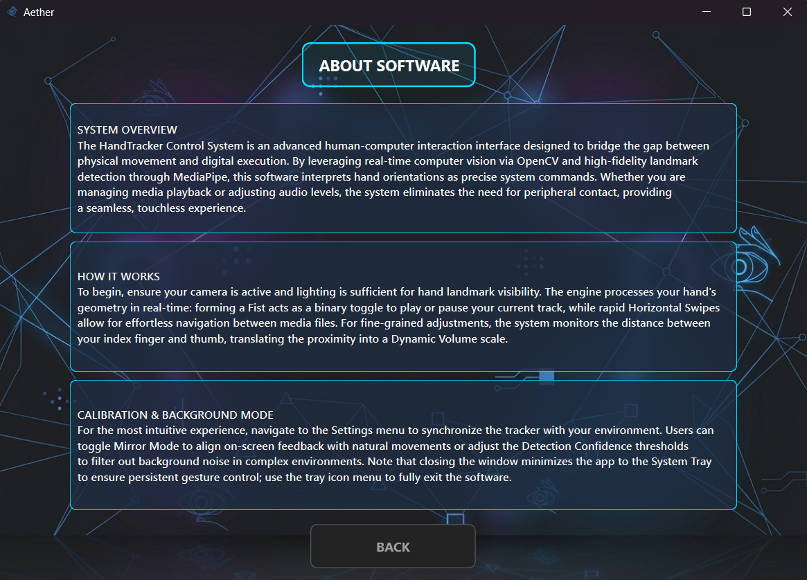
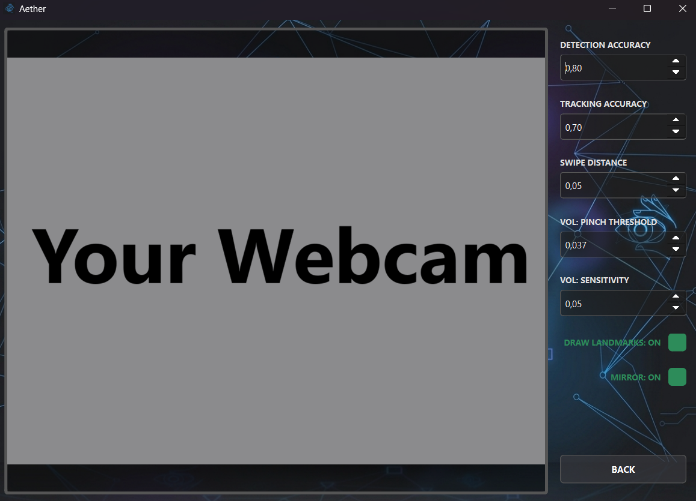
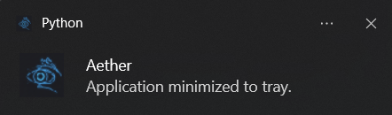

# 🌌 Aether Hand Tracker

A high-performance, minimalistic desktop application for **touchless system control** using

### **Hand Gesture Recognition**.

Developed with a focus on **modular architecture**, Aether allows you to control media and
volume without touching your mouse or keyboard.

---

## Core Gestures

|      Gesture       | Action                | Description                                             |
|:------------------:|:----------------------|:--------------------------------------------------------|
|      **Fist**      | **Play / Pause**      | Toggle media playback (Spotify, YouTube, etc.)          |
| **Vertical Pinch** | **Volume Control**    | Pinch index & thumb, then move up/down to adjust volume |
|     **Swipe**      | **Next / Prev Track** | Quick horizontal hand movement to skip songs            |

---

## Features

* **Real-time Hand Tracking:** Powered by **MediaPipe** for sub-millisecond latency.
* **System Tray Minimization:** Runs quietly in the background; double-click the tray icon to restore.
* **Live Calibration:** Adjustable sensitivity and confidence thresholds via the Settings menu.
* **Skeleton Visualization:** Toggleable landmark overlay for debugging and testing.
* **Asynchronous Engine:** Dedicated QThread for video processing to ensure UI responsiveness.
* **Immersive Dark Mode:** Native integration with Windows DWM for a seamless title bar experience.

---

## Tech Stack

* **Python 3.x**
* **MediaPipe:** State-of-the-art hand landmark detection.
* **PyQt6:** Modern GUI framework with custom QSS styling.
* **OpenCV:** Real-time video stream acquisition and processing.
* **PyAutoGUI:** Cross-platform system-level input simulation.

---

## Installation

1. **Clone the repository:**
   ```bash
    git clone [https://github.com/dig1tall/Aether-Hand-Tracker.git](https://github.com/dig1tall/Aether-Hand-Tracker.git)
    cd Aether-Hand-Tracker
   ```
2. **Create a Conda environment:**
   ```bash
    conda create -n aether_env python=3.10
    conda activate aether_env
   ```
3. **Install dependencies:**
   ```bash
    pip install -r requirements.txt
   ```

---

## Run

Make sure your webcam is connected and run the main script from the root directory:

```bash
python main.py
```

---

## Project Structure

```
Aether/
│── main.py
│── README.md
│── requirements.txt
│── LICENSE.txt
│── .gitignore
│── resources.qrc
│
├── src/
│   │── __init__.py
│   │── engine.py
│   │── tracker.py
│   │── controller.py
│   │── config.py
│   │── utils.py
│   └── main_window.ui
│
├── assets/
│   │── background.png
│   │── icon.png
│   │── logo.png
│   └── icon.ico
│
├── screenshots/
│   │── about_software_page.png
│   │── main_menu_page.png
│   │── settings.png
│   └── tray_notif.png
└──
```

---

## Architecture

The project follows a modular OOP design with a clear separation between the UI, the processing engine, and system
execution:

* `main.py` — Entry point. Handles the **PyQt6** application lifecycle and applies the Windows immersive dark theme.
* `src/render.py` (MainWindow) — Manages the graphical interface, coordinates navigation between pages, and handles
  system tray integration.
* `src/engine.py` (GestureEngine) — The logical core. Runs an asynchronous **QThread** to capture video and orchestrate
  the tracking pipeline without freezing the UI.
* `src/tracker.py` — Encapsulates **MediaPipe** logic. Processes frames to detect landmarks and translates hand
  movements into high-level gesture events.
* `src/controller.py` — The execution layer. Uses **PyAutoGUI** to simulate multimedia key presses (Play/Pause, Volume,
  etc.) at the OS level.
* `src/config.py` — Centralized configuration for gesture thresholds, UI paths, and MediaPipe confidence parameters.
* `src/utils.py` — Utility toolkit. Contains coordinate math (Euclidean distance), OpenCV-to-Qt image conversion logic,
  and resource path resolvers for standalone builds.

---

## Screenshots









---

## Future Improvements

### Functional

* **Gaze-Aware Activation:** Gestures will only trigger if the user is looking directly at the camera (Eye-tracking).
* **Custom Gesture Mapping:** Ability to rebind gestures to specific keyboard shortcuts.
* **Multi-App Profiles:** Unique control schemes for different applications (e.g., Zoom vs. Spotify).

### Technical

* **Model Optimization:** Moving to Lite models for even lower CPU/GPU usage on laptops.
* **Auto-Start:** Option to launch Aether on Windows startup.

---

## License

MIT License

---

## Author

### **Dovgash Matvey**

---
